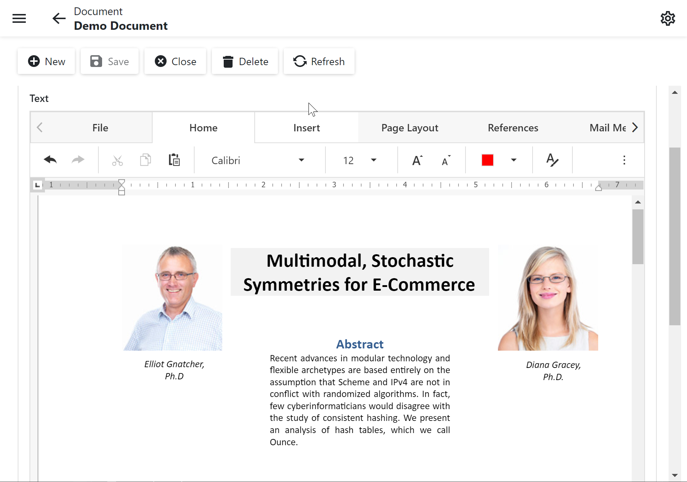

# How to edit rich text documents in XAF's Blazor UI

## Scenario
XAF's WinForms and WebForms apps support the [Office Module](https://docs.devexpress.com/eXpressAppFramework/400003/concepts/extra-modules/office-module/office-module-overview) for editing rich text documents. This Module integrates our WinForms RichEditControl and ASP.NET ASPxRichEdit controls into platform-specific Property Editors. Until the Office Module supports Blazor UI, it is possible to implement this functionality manually.

## Solution
We created a custom XAF Property Editor based on our [ASP.NET Core Rich Text Editor](https://docs.devexpress.com/AspNetCore/400373/rich-edit). 
To easily re-use our custom Property Editor in XAF Blazor apps, we implemented the editor in a Blazor Module project ([RichText.Module.Blazor](RichText.Module.Blazor)). For more information, review the following concepts:
- [Property Editors](https://docs.devexpress.com/eXpressAppFramework/113097/concepts/ui-construction/view-items/property-editors);
- [How to: Implement a Property Editor Based on a Custom Component (Blazor)](https://docs.devexpress.com/eXpressAppFramework/402189/task-based-help/property-editors/how-to-implement-a-property-editor-based-on-custom-components-blazor?p=netstandard);
- [Application Solution Components](https://docs.devexpress.com/eXpressAppFramework/112569/concepts/application-solution-components).


## Implementation Steps
**Step 1.** In the Solution Explorer, include *RichText.Module.Blazor.csproj* in your XAF Blazor solution and then reference this *RichText.Module.Blazor* project in the *YourSolutionName.Blazor.Server* project. In the *YourSolutionName.Blazor.Server/BlazorApplication.cs* file, create a `RichText.Module.Blazor.RichTextBlazorModule` instance and add it to the `XafApplication.Modules` collection. For more information, see [Add a Module in Code](https://docs.devexpress.com/eXpressAppFramework/118047/concepts/application-solution-components/ways-to-register-a-module#code).

**Step 2.** In the *YourSolutionName.Blazor.Server/Startup.cs* file, add the `services.AddRichTextBlazorModule();` line to the `Startup.ConfigureServices` method.

**Step 3.** A rich text document is stored as a base64 string and may be long. By default, Blazor Server allows transferring only 32KB through a SignalR hub. This may not be sufficient. Set the [HubOptions\.MaximumReceiveMessageSize](https://docs.microsoft.com/en-us/dotnet/api/microsoft.aspnetcore.signalr.huboptions.maximumreceivemessagesize?view=aspnetcore-5.0#Microsoft_AspNetCore_SignalR_HubOptions_MaximumReceiveMessageSize) property to `null` in the `Startup.ConfigureServices` method.

```cs
public void ConfigureServices(IServiceCollection services) {
    services.AddRazorPages();
    services.AddServerSideBlazor()
        .AddHubOptions(opt => {  //!!!
            opt.MaximumReceiveMessageSize = null;  //!!!
        });  //!!!
    services.AddHttpContextAccessor();
    services.AddSingleton<XpoDataStoreProviderAccessor>();
    services.AddScoped<CircuitHandler, CircuitHandlerProxy>();
    services.AddXaf<Solution1BlazorApplication>(Configuration);
    services.AddRichTextBlazorModule(); //!!!
}
```

**Step 4.** Make sure that you declared a byte array property for your rich text content as described at [Assign the Rich Text Property Editor to a Business Class' Property](https://docs.devexpress.com/eXpressAppFramework/400004/concepts/extra-modules/office-module/use-rich-text-documents-in-business-objects#in-code) . For more information, see the [Document](Solution1.Module/BusinessObjects/Document.cs#L27) class.
